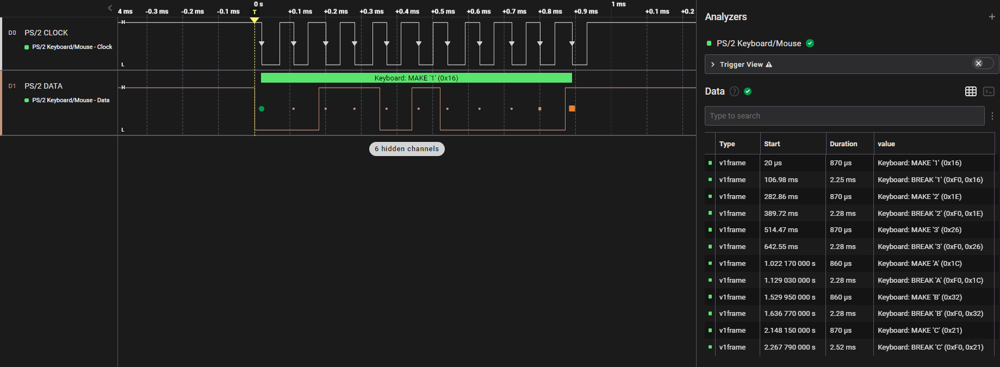
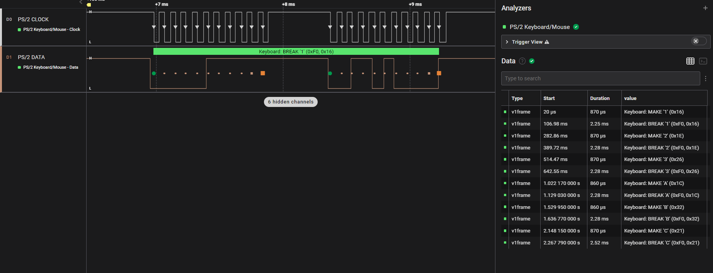

# The-Go-Board-PS2-keyboard-reader
## Phase 0.1 Keyboard Operation Verification.

Before starting the project, the  correct operation of the PS/2 keyboards will be verified.   

The keyboard is connected, through a PS/2 breakout board, to a logic level converter.   

### The folowing keys are pressed sequentially on the keyboard
| key |
| -| 
| 1 | 
| 2 |
| 3 | 
| a | 
| b | 
| c | 

### The following output is observerd with the logic analyzer.
The waveform for the press and release of the 1st key ( number 1 ) is shown.    
The list of all the recognised keypresses is shown in the table on the right side of the waveform.  

 