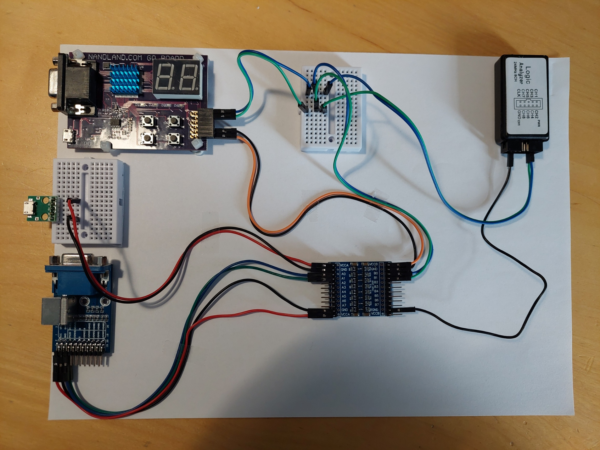

# The-Go-Board-PS2-keyboard-reader
 This is a project that connects a ps/2 keyboard to a " Go Board ".

 The Go board from nandland.com, is a small system that includes an FPGA, some peripherals and connectors on a circuit board,  allowing for easy creation of projects using an HDL such as Verilog or VHDL.
  
 The FPGA ( Lattice ice40HX1k ) on the go board operates at 3.3V Logic.
 The PS/2 keyboard operates at 5.0 V .
 Therefore, a logic level converter circuit is included in the design, to allow the 2 components to talk to eachother 

### A photo of the implementation

The Design Flow will be as folows : 

 #### 1. Keyboard and logic level converter operation verification.    

#### 2. HDL and simulation.    

#### 3. Synthesis and flashing the FPGA

